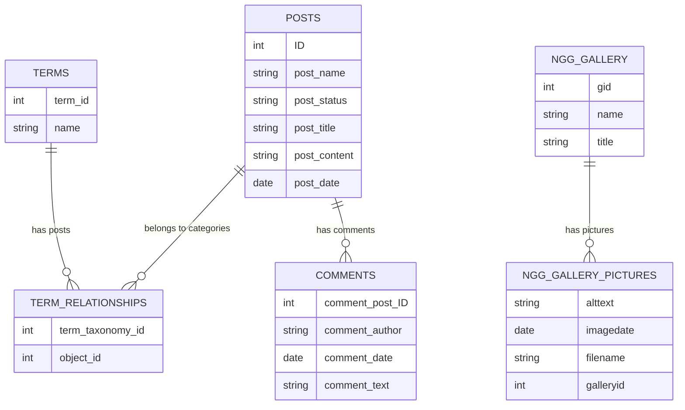

Pour la migration de mon site WordPress vers mon site static, il m'a fallu plusieurs années pour me décider. Je savais
que c'était pas une mince affaire. Je savais que j'allais devoir reprendre chaque article, copier son contenu, nettoyer
les parties des articles propres à WordPress. Pour être franc, j'étais découragé par la tâche à venir. J'avais déjà 
plusieurs fois regarder le contenu en base de données et une partie du markup est présent directement dans les articles
stockés en base de données.

<!--more-->

En cas d'extraction des articles depuis WordPress, il est forcément nécessaire de nettoyer tout ce qui est propre à 
WordPress pour ne garder que l'essence même des articles. De même que je savais également que les medias et galeries
demanderaient également du travail propre. Il restait également les commentaires qu'il faudrait extraire.

A la base, j'avais pensé simplement sauver des pages HTML et simplement servir ces pages depuis un serveur web tout 
bête. Ça aurait été probablement plus compliqué que la solution sur laquelle je suis arrivé. 

Sur cette base, j'ai débuté l'extraction des articles à la main, j'ai commencé à faire du nettoyage des balises HTML
à la main (avec l'aide de bons éditeurs de texte supportant les expressions régulières). A force de find/replace, je 
parvenais assez bien à sortir le contenu des articles depuis l'interface d'admin the WordPress, mais ça me prenait 
beaucoup, mais vraiment beaucoup de temps pour chaque article. 

Au bout de 4-5 articles, j'en avais déjà ras la casquette et j'en avais encore plus de 200 à extraire. Du coup, je me 
suis très vite rendu à l'évidence que le seul moyen d'être efficace serait de me brancher directement sur la base de 
données et d'extraire la data via ce moyen là. Ensuite, traiter les informations récupérées pour les convertir vers les
articles et collections pour le rendu dans Jekyll.

Ce processus d'écriture de script a été très itératif. Depuis un article extrait, puis un autre, et encore un autre, 
petit à petit, mes scripts se sont agrandis et ont couverts plus de cas de figure différents jusqu'à couvrir tous les 
use cases du site original.

# Base de données

Pour pouvoir écrire les scripts d'extraction des données, il a fallu commencer par identifier les données utilisables/
indispensables pour populer le site static. Pour se faire, il a fallu rétro-engineeré la base de données de mon site 
WordPress. J'ai créé un backup de la base, installer un MySQL sur ma machine puis j'ai restauré le backup dedans. 
A partir de ce stade, j'ai utilisé des outils pour me connecter à la base de données pour pouvoir l'analyser comme
phpmyadmin présent chez mon hébergeur.

Après avoir écrit les scripts d'extraction, j'en tire le diagramme d'entités suivant. Le diagramme contient les 
différentes tables et colonnes dont j'ai eu besoin pour les scripts d'extraction de données. Quand on y regarde de plus 
près, il n'y a pas beaucoup de tables, ni beaucoup de colonnes qui sont utiles. 

Une des parties "difficile" a été de comprendre le lien entre les articles et les terms qui représente le lien 
d'appartenance aux catégories. Dans le jargon, on parle d'une relation `n:n`. Il s'agit de dire qu'un article (post) 
est relié à une ou plusieurs catégories, une catégorie est possède un ou plusieurs articles.

### Base de données - Les Requêtes

A partir du moment où je disposais des informations liant les données entre elles, il m'a suffit d'écrire quelques 
requêtes SQL et le tour était joué. Je vous propose de passer en revue ces quelques requêtes.

La première requête permet de récupérer un article donné. On notera que la requête récupère toutes les colonnes de
l'article alors que je n'en utilise que certaines. C'est pas la meilleure des pratiques mais c'est plus rapide et vu
le use case, c'est tolérable :smiley: On peut également noter la présence d'un `?` dans la requête. Nous verrons plus
tard pourquoi mais en résumé il s'agit d'un token qui sera remplacé par la suite. On parle de `prepared statements`.

~~~sql
SELECT
  *
FROM
  wpjapan_posts
WHERE
  post_name = ?
  and post_status = 'publish';
~~~

La seconde requête s'occupe de récupérer la liste des catégories aux quelles un article est attaché. Un article peut 
être présent dans plusieurs catégories. La requête est un peu plus complexe car elle nécessite des jointures entre les
tables. On note cette fois que seules les colonnes de la table `TERMS` sont récupérées. De nouveau on utilise un `?`
comme placeholder pour notre `prepared statement`.

~~~sql
SELECT
  t.*
FROM
  wpjapan_terms AS t
LEFT JOIN
  wpjapan_term_relationships AS tr ON t.term_id = tr.term_taxonomy_id
LEFT JOIN
  wpjapan_posts AS p ON tr.object_id = p.ID
WHERE
  p.ID = ?
  and p.post_status = 'publish';
~~~

Avec ces deux requêtes, je dispose de toutes les informations nécessaires pour construire le contenu d'un article et 
ses catégories.

A présent, nous allons récupérer les commentaires. Pour ça, il nous faut regarder la table des commentaires. La requête
suivante permet de récupérer les commentaires d'un article. La requête est assez simple. On récupère toutes les colones
d'un commentaire même si je ne les utilise pas toutes. De nouveau la présence d'un token `?` vu qu'il s'agit encore d'un
`prepared-statement`.

~~~sql
SELECT
  *
FROM
  wpjapan_comments
WHERE
  comment_post_ID = ?
ORDER BY
  comment_date ASC;
~~~

Les infos extraites par ces requêtes sont liées entre elles via un lien fort en base de données. Pour les galleries, ce
lien fort n'existe pas directement. Le lien, que l'on peut nommer `soft-link`, se trouve directement dans le contenu de
l'article. Chaque fois qu'un article présente une galerie dans WordPress, un tag est présent dans le contenu de
l'article qui sera remplacé par le processing de WordPress. 

Pour retrouver la bonne galerie, le tag contient l'`ID` unique de la galerie en base de données. Il suffit donc de 
parser ces tags pour en extraire les `ID` puis de récupérer les galeries via ces `ID`. La requête suivante récupère les
informations d'une galerie grâce à son `ID`. Comme toujours, nous avons le token `?`.

~~~sql
SELECT
  *
FROM
  wpjapan_ngg_gallery
WHERE
  gid = ?;
~~~

Et finalement, il nous faut extraire la liste des images d'une galerie. Cette extraction se fait grâce à la requête 
suivante. Rien de bien compliquer. On connait l'`ID` de la galerie, il suffit de l'utiliser pour récupérer toutes les 
images liées à une galerie. Encore une fois, le token `?` est présent pour le `prepared statement`.

~~~sql
SELECT
  *
FROM
  wpjapan_ngg_pictures
WHERE
  galleryid = ?
ORDER BY
  imagedate ASC;
~~~

Avec ces cinq requêtes, je suis capable d'extraire toutes les données brutes WordPress et de les processer pour créer 
les fichiers textuels.

# Processing des Données

Cette partie se complique largement non pas par la logique algorithmique qui découle du processing des données mais par
le fait que pour nettoyer les données, j'ai utilisé passablement d'expression régulières. Pour les écrire, ça a demandé
pas mal d'effort.

### Processing des Données - Smileys

Dès le départ, je me suis rendu compte que mon site WordPress incluait un moteur de remplacement de texte vers des 
émoticônes. C'est super joli les smileys, mais c'est pas pratique quand on passe d'un système à un autre et que les
codes des émoticônes ne sont pas les mêmes. Dans mon site statique, j'inclus un système de remplacement de smileys basé
sur github qui se nomme `jemoji`.

Le problème s'est vite montré vu que les émoticônes remplacées par `jemoji` ne sont pas les mêmes que ceux remplacés 
dans mon WordPress. J'ai écrit un petit code de mapping pour remplacer les smileys. J'ai tenté autant que faire se peut
de garder une correspondance 1:1 entre les codes présents dans WordPress et ceux présents dans Github. Et aussi de 
garder une correspondance d'image.

Le code Ruby suivant effectue un remplacement de texte pour les smileys. Chaque association source smiley vers target
smiley est listé dans ce bout de script (dans l'exemple suivant, seuls quelques lignes d'association sont présentées).
On pourrait écrire un code plus propre, loader des confs depuis un fichier, … mais au final avoir ces mappings dans du
code ça fonctionne tout aussi bien et ça reste simple d'approche.

~~~ruby
def smilleys(content)
  " #{content}"
    .gsub(" :D", " :laughing:")
    .gsub(" ;)", " :wink:")
    .gsub(" ))", " :relieved:")
    .gsub(" :=", " :grin:")
    # … Encore d'autres règles
    .strip()
end
~~~

On remarque que le code est simple. La particularité vient du fait qu'on ajoute un espace en début de contenu pour
traiter le cas spécifique d'un contenu commençant par un smiley. Pour réduire les faux positifs, les remplacements 
effectués de manière erronée, je remplace toujours `<espace><code_smiley>`. En cours d'extraction des articles, je me 
suis rendu compte que la majorité du temps, les smileys étaient toujours précédés d'un espace. A la fin du 
remplacement, on élimine les espaces superflus de début et de fin de contenu.

### Processing des Données - Les Commentaire

Le processing des articles fait appel à tous les autres processing de données. Depuis un article, on va extraire les
commentaires et les galeries, s'occuper des media. Il y a toute une série d'extraction et de traitement des données. 
Pour les commentaires, c'est la dernière extraction dans le flot de traitement d'un article.

Le code suivant présente les grandes lignes de l'extraction des commentaires. Le code présenté est un peu simplifier 
par rapport à sa version réelle (pas de dry mode, …).

~~~ruby
def comments(post_name, post_id, post_date)
  # Création de la connexion à la base de données
  client = db_client

  # Le fameux prepared statement pour la requête SQL
  statement_comments = client.prepare(…)

  # On exécute la requête qui nous retourne une liste de commentaires bruts à traiter
  result_comments = statement_comments.execute(post_id)

  # On process les résultats pour extraire l'auteur, la date formatée et le contenu
  # du commentaire que l'on groupe dans une structure de type map. Le tout est ajouté 
  # dans une liste
  comments = result_comments..collect! do |row|
    {
      'author' => row['comment_author'],
      'date' => row['comment_date'].strftime('%Y-%m-%d %H:%M:%S %z'),
      'text' => sanitize_comment(row['comment_content'])
    }
  end

  # On convertit les commentaires en YAML
  yaml_content = comments_to_yaml comments

  # On finit par écrire le résultat YAML au bon endroit dans les 
  # collections uniquement si au moins un commentaire est présent
  base_dir = File.expand_path("#{File.dirname(__FILE__)}/..")
  post_date = post_date.strftime('%Y-%m-%d')
  file_path = "#{base_dir}/_data/comments/#{post_date}-#{post_name}.yaml"
  File.open(file_path, 'w') { |file| file.write(yaml_content) } if comments.count >= 1
end
~~~

 
Comme déjà expliqué, un article a son nom sous forme de `<year>-<month>-<day>-<title>.md` et le fichier des commentaires
a son nom sous le format `<year>-<month>-<day>-<title>.yaml`. Cette convention permet de très facilement de passer d'un
fichier à l'autre.


Dans le code précédent, nous avons un appel à une fonction `sanitize_comment`. Il s'agit de prendre le contenu d'un 
commentaire et d'en faire une version textuelle stockable dans le fichier `yaml`. Le contenu de la fonction est 
présentée ci-après. C'est dans ce code que les choses commencent à se corser vu l'utilisation des expression 
régulières.

~~~ruby
def sanitize_comment(comment)
  word_wrap smilleys(
    # Avant toute chose, on s'assure qu'il n'y pas d'espace superflu
    # et on normalise les retour de lignes
    comment
      .strip
      .gsub(/\r\n/, "\n")
  )
  
  # Certains remplacement de smiley vont produire suite :a:b: qui ne sont pas 
  # correctement remplacées par jemoji. J'élimine les éléments en trop tout 
  # en sachant qu'il s'agit d'une perte de contenu que je considère acceptable 
  # et le cas ne se produit pas très souvent.
  .gsub(/(:[a-z_]+:)[a-z_]+:/, "\\1")
  
  # On supprime les espaces de fin de commentaires, on remplace les espaces
  # multiples par un espace.
  .gsub(/ $/, "")
  .gsub(/ {2,}/, " ")
  
  # On élimine un caractère particulier présent dans certains commentaires
  .gsub("\\x01", "")
  
  # On remplace les ... par … (cosmétique quand tu nous tiens)
  .gsub(/\.\.\./, "…")
end
~~~

Dans le bout de code précédent, on fait également appel à une fonction `word_wrap` qui est une petite fonction 
utilitaire récupérée depuis 
[`Ruby on Rails`](https://github.com/rails/rails/blob/7c70791470fc517deb7c640bead9f1b47efb5539/actionview/lib/action_view/helpers/text_helper.rb#L264){:target="_blank"}.
Ce bout de code permet de limiter la taile des lignes à `n` caractères et automatiquement ajouter des retours de lignes
là où c'est nécessaire. C'est purement cosmétique car ça n'a pas d'incident sur les données elles-mêmes. Je vous mets
le code pour référence ci-dessous.

~~~ruby
LINE_WIDTH = 115
BREAK_SEQUENCE = "\n"

def word_wrap(text)
  text.split("\n").collect! do |line|
    if line.length > LINE_WIDTH 
      line.gsub(/(.{1,#{LINE_WIDTH}})(\s+|$)/, "\\1#{BREAK_SEQUENCE}").rstrip
    else
      line
    end 
  end * BREAK_SEQUENCE
end
~~~

Lorsque la liste des commentaire est prête pour l'export, il ne reste plus qu'à produire le fichier `yaml` des 
commentaires pour l'article. Le code suivant s'occupe de ça.

~~~ruby
def comments_to_yaml(comments)
  comments
    # On produit le contenu des commentaires en yaml
    .to_yaml(line_width: 110)
  
    # Malheureusement, l'output est un peu différent de ce que j'aimerai à 
    # la fin et par conséquent je transforme ce contenu pour mes besoins
    .gsub(/text: ((>-|\|-)\n {4})?/, "text: |\n    ")
    
    # Pour chaque commentaire, je veux ajouter une ligne vide pour facilement
    # identifier les commentaires dans le fichier YAML résultant
    .gsub(/\n(- author:)/, "\n\n- author:")
    
    # J'enlève le marqueur de document YAML
    .gsub(/---\n\n/, "")
  
    # Certains commentaires se retrouvent avec des '' englobant (je ne sais pas
    # vraiment pourquoi) et je les enlèves
    .gsub(/^\s{4}'/, "    ")
    .gsub(/'\n$/, "\n")
  
    # Parfois, on se retrouve avec des doubles '' comme une sorte d'échappement
    # et dans ce cas, je les remplace par un seul '
    .gsub(/''/, "'")
  
    # On force la présence d'espaces si par hasard on se retrouve avec des tab
    .gsub(/^\s{4}-/, "    ﹣")
end
~~~

Et du coup, l'extraction de commentaires produit le genre de résultat suivant. Une liste de commentaires séparés par des
lignes vides avec pour text un bloc de text `yaml`. Dans l'exemple ci-dessous, les commentaires sont volontairement
tronqués pour des raisons visuels dans cet article.

~~~yaml
- author: Raph'
  date: '2008-07-14 09:55:20 +0200'
  text: |
    Vouaip, bon vent, Frangin !
    
    Surtout, n'oublie pas le kanji … Ca peut aider… :satisfied:

- author: Cid
  date: '2008-07-15 08:55:23 +0200'
  text: |
    Et bien voilà pour … à commencé :wink:

    Il me tarde de pouvoir … beaucoup :smiley_cat:
~~~

### Processing des Données - Les Galeries

Nous avons terminé avec les commentaires, à présent nous pouvons aborder le traitement des galeries. La particularité
du traitement des galeries vient du fait que tous les articles n'ont pas de galerie et certains articles ont plusieurs
galeries. L'autre particularité tient au fait qu'une galerie d'images c'est des images. Bah oui, forcément, y a des 
fichiers et donc il faut récupérer aussi les fichiers et les stocker avec les meta données de la base de données.

Comme pour les commentaires, les données sont stockées en base de données. Il suffit d'extraire les données, appliquer
quelques transformations et les stocker de manière à pouvoir les retrouver facilement dans les articles au moment du 
rendu.

Pour l'extraction des fichiers, je n'y suis pas allé par 4 chemins. J'ai été récupérer tout le répertoire d'images de 
mon blog WordPress et je l'ai stocké à dans un folder sur mon ordinateur. J'ai ensuite écrit mon script en tenant compte
de l'emplacement de ce folder. 

L'extraction d'une galerie commence avant tout avec une préparation de quelques variables pour disposer des bons 
chemins de fichiers aux données et aux fichiers d'image. Puis on lance l'extraction.

~~~ruby
# Le download path est simplement l'emplacement des galeries téléchargées
# depuis le blog WordPress.
DOWNLOAD_PATH = File.expand_path '~/Downloads/…'

# Le base directory est la racine du site statique.
BASE_DIR = File.expand_path("#{File.dirname(__FILE__)}/..")

def gallery(id)
  # On commence par récupérer le nom de la galerie présent en base de données.
  # L'ID de la galerie est récupérer pendant le traitement des articles.
  name, title = extract_gallery_data id

  # Ce chemin représente l'emplacement des fichiers depuis le blog WordPress
  source_path = "#{DOWNLOAD_PATH}/#{name}"
  
  # C'est l'emplacement des galeries dans le site static. C'est depuis
  # ce chemin que sont servies les images.
  site_path = "/assets/images/galleries/#{name}"
  
  # Le dest path constitue l'emplacement dans le site statique des
  # galeries du site. Mais cette fois du point de vue stockage de fichiers
  # et non pas servir des fichiers via le serveur web.
  dest_path = "#{BASE_DIR}/assets/images/galleries/"
  
  # On prépare le répertoire de destination avec le nom de la galerie.
  files_path = "#{dest_path}/#{name}"
  
  # Et finalement le chemin du fichier des méta données de la galerie.
  data_path = "#{BASE_DIR}/_data/galleries/#{name}.yaml"

  # On déplace le répertoire des images de l'ancien blog vers le site
  # statique si le répertoire source existe encore.
  FileUtils.mv(source_path, dest_path) if Dir.exist?(source_path) 
  
  # Et finalement, on lance le processing des images
  gallery_images id, name, title, site_path, data_path, files_path
end
~~~

L'extrait de code suivant présente la récupération des données d'une galerie depuis la base données. Ce n'est pas la
partie la plus complexe du code de traitement des données des galeries.

~~~ruby
def extract_gallery_data(id)
  # On prépare la connection à la base, la requête SQL puis
  # on exécute la requête.
  client = db_client
  statement_gallery = client.prepare("…")
  result_gallery = statement_gallery.execute(id).first

  # Avec le résultat obtenu, on récupère le nom et le titre
  # de la galerie. Le nom étant proche d'un slug d'URL.
  return result_gallery['name'], result_gallery['title']
end
~~~

Dans l'extrait de code suivant, on attaque le traitement des images. Il faut d'abord récupérer la liste des images 
depuis la base de données et les faire correspondre avec ce que l'on récupère sur le système de fichiers. Tout ça mis
ensemble permet de construire les meta données des images et de la galerie pour les stocker dans le fichier de
collection correspondant.

~~~ruby
def gallery_images(id, name, title, site_path, data_path, files_path)
  # On commence par récupérer la liste des images présentes en base de données 
  # pour la galerie. On stock également la première date pour un cas particulier
  first_date, extracted_images = extract_images id

  # On récupère la liste des fichiers présents dans le répertoire de la galerie.
  files = Dir.glob('*.JPG', files_path).sort

  # Une image est constituée de deux données de base qui sont 
  # son titre et sa date. 
  images = files.map do |file_name|

    # Il est arrivé que des images présentes dans le répertoire 
    # n'étaient pas présentes en base de données d'où ce petit 
    # test avec des valeurs par défaut.
    if extracted_images[file_name].nil?
      image_data = { 'title' => 'n/a', 'date' => first_date }
    else
      image_data = extracted_images[file_name]
    end

    # Finalement, on enrichi les données d'une image avec son nom de fichier,
    # son chemin d'accès vis à vis du site, et ses miniatures.
    {
      **image_data,
      'file' => file_name,
      'path' => File.join(site_path, file_name),
      'thumb' => File.join(site_path, 'thumbs', "thumbs_#{file_name}")
    }
  end

  # Finalement, on prépare les méta data de toute la galerie qui consiste en son
  # titre, sa date qui correspond à la première image et sa liste d'images.
  gallery = { 'name' => title, 'date' => first_date, 'images' => images }

  # On prépare le contenu yaml avec un retraitement du contenu.
  yaml_content = gallery_to_yaml gallery

  # On sauvegarde le contenu dans le fichier de collection de la 
  # galerie d'images.
  File.open(data_path, 'w') { |file| file.write(yaml_content) }

  # Et pour finir, on retourne le tag Liquid qui va bien pour l'insérer
  # dans l'article à la place de l'ancien tag WordPress.
  "{% include gallery.html gallery=\"#{name}\" %}"
end
~~~


Une galerie dispose, en plus de ses fichiers, de ses miniatures. Il s'avère que toutes les galeries ont la même 
structure de stockage de fichiers ce qui simplifie beaucoup l'enrichissement des méta données d'une galerie d'images.


Une autre partie intéressante de ce traitement des données des galeries se trouve dans la récupération des données des
images depuis la base de données. Le code suivant s'occupe de cette partie de récupération.

~~~ruby
# C'est le format de date que je veux appliquer
# Exemple: 
#   2008-09-23 12:11_10 +0000
DATE_FORMAT = '%Y-%m-%d %H:%M:%S %z'.freeze

def extract_images(gallery_id)
  # On prépare et exécute la requête pour récupérer les données.
  result = client.prepare("…").execute(gallery_id)

  # Petite variable pour savoir si on a déjà la première date ou non.
  first_date = nil

  # On retourne la première date récupérée et la map des données d'image
  return first_date, result
    .map do |row|
      # On sauve la première date récupérée
      first_date ||= row['imagedate'].strftime(DATE_FORMAT)

      # On prépare un tableau par image avec son nom de fichier,
      # une map avec son titre et sa date.
      # Exemple: 
      #   ["filename", { "title" => "titre", "date" => "2008-09-23 12:11_10 +0000" }]
      [
        row['filename'],
        {
          'title' => sanitize_title(row['alttext']),
          'date' => row['imagedate'].strftime(DATE_FORMAT)
        }
      ]
    end
  
    # Cette dernière instruction va transformer le tableau de tableau en map
    # Exemple: 
    #   [["file1", {…}], ["file2", {…}]] -> { "file1" => {…}, "file2" => {…}}
    .to_h
end
~~~

Dans l'extrait de code précédent, les plus attentifs auront vu qu'on applique un traitement sur le titre de chaque 
image. Comme pour les commentaires, les titres d'images peuvent contenir des smileys, des `...` à convertir en `…` et 
deux trois petits traitements additionnels qui sont présentés ci-après.

~~~ruby
def sanitize_title(title)
  # On applique le traitement des smileys comme pour les commentaires.
  smileys(
    title
      # On enlève les espaces superflus 
      .strip
  
      # On remplace single quotes avec caractère d'échappement, 
      # ou présent avec son code HTML par de vrais single quotes
      .gsub("\\'", "'")
      .gsub(/(\\)?&#039;/, "'")
  )
  
  # On retraite les doubles remplacements de smileys éventuels
  .gsub(/(:[a-z_]+:)[a-z_]+:/, '\\1')
  
  # On remplace les trois points
  .gsub('...', '…')
end
~~~


Le traitement d'un titre d'image est vraiment très proche du traitement des commentaires. On pourrait factoriser une
partie du code probablement mais l'effort en vaut pas vraiment la peine à ce stade.


Et pour finir le traitement des galeries, on applique la transformation de la structure de données de la collection 
vers le format `yaml` avec quelques transformations additionnelles présentées ci-dessous.

~~~ruby
def gallery_to_yaml(gallery)
  gallery
    # Crée le contenu YAML avec une limite à 110 caractères par ligne.
    .to_yaml(line_width: 110)
    
    # Nettoie les titres pour avoir un certain format YAML.
    .gsub(/title: (>-\n {4})?/, "title: |\n    ")
    .gsub(/(\s+thumb:\s.*)/, "\\1\n")
    .gsub(/---\n/, '')
    
    # Enlève les quotes inutiles
    .gsub(/^\s{4}'/, '    ')
    .gsub(/:'\n/, ":\n")
  
    # Supprime les doublement de simple quotes
    .gsub(/''/, "'")
  
    # Supprime les double quotes
    .gsub(/(\s{4})"/, '\\1')
    .gsub(/"(\n)/, '\\1')
  
    # Remet les double quotes supprimer en trop sur les chemin de fichiers.
    .gsub(%r{(/.*?\.[jJ][pP][gG])}, '\\1"')
end
~~~

Et voilà, on a terminé avec le traitement des galeries. Ce traitement s'applique une ou plusieurs fois suivant les 
galeries et parfois pas du tout.

### Processing des Données - Les Articles

Finalement, nous y sommes, les articles. Le processing des articles dispose de ces propres algorithmes et fait appel
aux algorithmes que nous avons vus précédemment. Nous allons nous attarder à présent sur la partie de processing des
articles qui se trouve être également un morceau assez conséquent.

Sans plus attendre, le premier extrait de code est l'algorithme général de traitement d'un article. C'est le fil 
conducteur qui fait appel à tous les autres éléments.

~~~ruby
def post(name)
  # Récupère les data lié à un article.
  post = retrieve_post name

  # Prépare le front matter indispensable pour Jekyll.
  front_matter = front_matter post

  # Process le contenu de l'article pour nettoyer le texte,
  # extraire les media et les galeries.
  post_content = sanitize_post_content post[:post_content]
  post_content = process_media post_content, post
  post_content = process_gallery post_content

  # Un petit peu de nettoyage avec les retours de ligne
  # parfois un peu trop nombreux.
  post_content = post_content.gsub(/\n{2,}/, "\n\n")

  # Prépare le contenu complet et sauve le contenu dans
  # le fichier d'article.
  full_content = "#{front_matter}#{post_content}"
  File.open(post[:path], 'w') { |file| file.write(full_content) }

  # Process les commentaires de l'article s'il y en a.
  comments post[:name], post[:id], post[:date]
end
~~~

Avant de pouvoir faire quoi que ce soit, il faut déjé récupérer les données de l'article. C'est ce qui est présenté 
dans le code suivant.

~~~ruby
# Le base directory est la racine du site statique.
BASE_DIR = File.expand_path("#{File.dirname(__FILE__)}/..")

def retrieve_post(post_name)
  # Prépare et exécute la requête pour retrouver les informations de l'article dont son ID.
  client = db_client
  statement_post = client.prepare("…")
  result_post = statement_post.execute(post_name).first
  post_id = result_post["ID"]

  # Fait de même pour les catégories de l'article.
  statement_categories = client.prepare("…")

  # Prépare quelques informations sur la date
  year = result_post['post_date'].strftime('%Y')
  month = result_post['post_date'].strftime('%m')
  short_date = result_post['post_date'].strftime('%Y-%m-%d')

  # Et finalement, on retourne une map avec les différentes info de l'article. 
  # On profite d'avoir les infos sous la main pour enrichir les data.
  {
    id: post_id,
    name: name,
    date: result_post['post_date'],
    short_date: short_date,
    formatted_date: result_post['post_date'].strftime('%Y-%m-%d %H:%M:%S %z'),
    title: result_post['post_title'],
    content: result_post['post_content'],
    categories: categories_str(statement_categories.execute(post_id)).join(", "),
    path: "_posts/#{short_date}-#{name}.md",
    images_path: "#{BASE_DIR}/assets/images/posts/#{short_date}-#{name}",
    media_path: "#{BASE_DIR}/assets/media/posts/#{short_date}-#{name}",
    download_image_subpath: "#{year}/#{month}"
  }
end
~~~

Dans le code précédent, on applique un traitement aux catégories récupérées de l'article. Il s'agit de remplacer les 
HTML entities. Le code suivant s'occupe de restaurer les `&` présents dans certaines catégories.

~~~ruby
def categories_str(categories)
  categories.map do |result|
    "\"#{result['name'].gsub(/&amp;/, '&')}\""
  end
end
~~~

A présent, avec les données d'un article, nous pouvons commencer à préparer le `front matter` que Jekyll a besoin pour
générer les contenus statiques.

~~~ruby
# La préparation du front matter n'est rien d'autre que de la string
# interpolation depuis les données d'un article.
def front_matter(post)
  """---
layout:     post
title:      #{post[:title]}
date:       #{post[:date]}
categories: [#{post[:categories]}]
---

"""
end
~~~

Après la préparation du `front matter`, on peut s'attaquer au contenu d'un article. Le contenu d'un article demande 
plus de travail car il faut commencer par nettoyer le contenu. Le code suivant s'en charge.

~~~ruby
def sanitize_post_content(content)
  lines = smileys(content)
    # Élimine les lignes non vides.
    .split("\n").map(&:strip).reject(&:empty?)
    
    # Traite chaque ligne.
    .map do |line|
      case line

      # supprime les tag HTML de paragraphes avec des liens.
      when /<p.*?><a/
        line.gsub(%r{(<p.*?>|
)}, '')
      
      # Traite les lignes sans tag HTML.
      when /^\w/
        word_wrap line
      
      # Supprime les tag HTML de paragraphe et traite la ligne.
      when /<p.*?>/
        word_wrap line.gsub(%r{(<p.*?>|
)}, '')

      # Pour tout le reste, on reprend la ligne telle quelle.
      else
        line
      end
    end

  lines
    # On remet ensemble les lignes avec 2 retours de ligne.
    .join("\n\n")
  
    # Remplace les tag HTML de séparations de paragraphe. 
    .gsub(%r{<hr( /)?>}, "-----\n")
    
    # Supprime les échappements de quotes ou les HTML entities.
    .gsub("\\'", "'")
    .gsub(/(\\)?&#039;/, "'")
  
    # Remplace le mot yen par son symbole monétaire.
    .gsub(/(\d+)\s*?[yY][eE][nN]/, '\\1¥')
  
    # S'assure d'avoir des espaces simples et pas multiples.
    .gsub(/ {2,}/, ' ')
  
    # Élimine les espaces après les smileys avant une 
    # parenthèse fermante.
    .gsub(/: \)/, ':)')
end
~~~


Tout ce retraitement des articles pour la partie remplacement et nettoyage du contenu s'est fait empiriquement. Je 
convertissais un article, je regardais le résultat et quand je voyais que certains choses je répétais le traitement
à la main, je modifiais mon script pour en tenir compte.

L'avantage de mon script, c'est qu'il ne supprime pas les données sources en dehors du déplacement des galeries. Du
coup, je peux tourner plusieurs fois mon script ce qui modifiera les données à la sortie. Donc, quand je modifiais
mon script suite au constat d'un élément à ajouter depuis un article extrait, je pouvais simplement exécuter mon 
script et voir l'impact du changement.


L'étape suivante de traitement du contenu des articles c'est le remplacement des tag HTML de media par les tag Liquid
correspondant comme on peut le voir dans le code suivant.

~~~ruby
def process_media(content, post)
  # Première chose à faire, récupérer tous les liens présent dans un article
  # ce qui va forcément apporter un peu de bruit parce qu'il n'y pas que des
  # images ou vidéos mais des liens normaux sont aussi présents.
  #
  # Le petit souci, et on pourrait sûrement faire différemment, c'est que
  # mon expression régulière capture par moment une série de liens contigus.
  # Dans ce cas, on s'assure d'en faire une liste de liens en gardant
  # le block de liens original.
  sanitized_blocks = content.scan(%r{<a.*/a>}).map do |a_block|
    {
      original: a_block,
      list: a_block.gsub(%r{</a><a}, "</a>\n<a").split("\n")
    }
  end

  # On traite chaque lien
  sanitized_blocks.each do |block|
    block[:list].each do |elem|
      # La première détection tentée c'est les image. Dans ce cas, on se trouve
      # en présence de tags de lien et d'image don on extrait les info nécessaires.
      elem.scan(%r{<a href=".*/(.*?)(.jpg)">})
        .each do |image|
        
        # On traite la hauteur d'une image à part car elle peut être
        # placée avant ou après la largeur et j'ai besoin de respecter
        # l'ordre largeur, puis hauteur.
        height = elem.gsub(/.*?height="(\d+)".*/, '\\1')
        image << height
        
        # Finalement, on peut préparer le tag Liquid d'une image
        # en passant les différentes informations.
        media_str = create_image_file paths, post, *image
        
        # Et le dernier point important, on remplace la partie
        # HTML détectée par le tag Liquid.
        content = content.sub(elem, media_str)
      end

      # Une fois qu'on a traité les images, on fait de même avec les vidéos.
      elem.scan(%r{<a href=".*/(.*?)(.mpg)">(.*?)</a>}).each do |media|
        media_str = create_media_file paths, post, *media
        content = content.sub(elem, media_str)
      end
    end
  end

  # Il ne faut pas oublier de retourner le contenu transformé.
  content
end
~~~

Très bien, nous avons vu comment sont traités les images et les media pour retrouver les informations nécessaires pour
remplacer le HTML par des tags Liquid. A présent, regardons comment est créé un tag Liquid pour une image ainsi que le
déplacement du fichier d'image depuis répertoire du blog WordPress vers sa destination dans le site statique.

~~~ruby
def create_image_file(post, img_name, extension, title, width, height)
  # Certaines images sont en mode portrait et d'autres en mode paysage.
  # La taille déterminante dépendait de l'appareil photo utilisé mais
  # se résumait à ces deux seules possibilités.
  orientation = %w[225 200].include?(width) ? 'portrait' : 'landscape'

  # Le nom de fichier d'une miniature était aussi constant dans
  # sa construction.
  thumb = "#{width}x#{height}"

  # On va déplacer les fichiers de l'image et pour ça on crée
  # un tableau pour pouvoir itérer dessus.
  files = %W[#{img_name}#{extension} #{img_name}-#{thumb}#{extension}]

  # On crée le répertoire de destination si ce n'es pas encore le cas.
  Dir.mkdir(post[:images_path]) unless Dir.exist? post[:images_path]

  # On déplace l'image et sa miniature.
  files.each do |file|
    source_path = "#{DOWNLOAD_PATH}/#{post[:download_image_subpath]}/#{file}"
    FileUtils.mv(source_path, post[:images_path]) if File.exist? source_path
  end

  # Finalement on forge le tag Liquid et on le retourne.
  """
{% include img.html
    image=\"#{img_name}#{extension}\"
    type=\"#{orientation}\"
    thumb_size=\"#{thumb}\"
    title=\"#{title}\"
    gallery=\"img\"
%}

"""
end
~~~

Pour les fichiers de media, la procédure est très similaire. Le code suivant l'illustre.

~~~ruby
def create_media_file(post, media_name, extension, title)
  # Cette fois, un seul fichier est présent. Il n'y pas de miniature.
  file = "#{media_name}#{extension}"

  # Crée le répertoire de destination si besoin.
  Dir.mkdir(paths[:media_path]) unless Dir.exist? post[:media_path]

  # Et finalement, déplace le fichier de media si pas déjé fait.
  source_path = "#{DOWNLOAD_PATH}/#{post[:download_image_subpath]}/#{file}"
  FileUtils.mv(source_path, post[:media_path]) if File.exist? source_path

  # Pour terminer on prépare le tag Liquid et on le retourne.
  """
{% include media.html
    media=\"#{media_name}.mp4\"
    title=\"#{title}\"
    gallery=\"video\"
%}

"""
end
~~~

Il ne nous reste plus que la partie du traitement des galeries d'un article. Du moins, il s'agit du lien entre la partie
que nous avons étudié auparavant et l'appel que nous en faisons depuis le traitement d'un article. C'est le travail
de l'extrait de code suivant.

~~~ruby
def process_gallery(content)
  # Traite chaque tag WordPress de galerie présent dans un article.
  content.scan(/\[(?:ng)?gallery(?:=| id=)(\d+)\]/).each do |gallery_match|
    
    # On applique le traitement de galerie grâce à l'id que l'on a retrouvé.
    gallery_str = gallery gallery_match[0]
    
    # Puis on remplace le tag WordPress de galerie par le tag Liquid 
    # correspondant. Pour rappel, ça donne quelque chose comme ça:
    #   "{% include gallery.html gallery=\"#{name}\" %}"
    content = content.gsub(/\[(ng)?gallery(=| id=)(\d+)\]/, gallery_str)
  end

  # On n'oublie pas de retourner le contenu transformé
  content
end
~~~

# Conclusion

Et voilà. C'est terminé pour la partie script de conversion des articles du blog WordPress vers les contenus statiques
du site Jekyll.

Bien sûr, ce n'est pas hyper trivial mais il faut imaginer faire tout se travail à la main. Pour être honnête, il n'y a
aucune chance qu'à la main j'aie été au bout de la démarche de conversion de mon blog WordPress. Pour rappel, j'avais
commencé à la main et au bout d'une dizaine d'article sur 200, j'ai abandonné et j'ai écrit ces scripts.

L'écriture des scripts ne s'est pas fait en une traite. Il m'a fallu de nombreuses itérations pour couvrir la majorité
des cas possibles présents dans les contenus WordPress mais comme ma source de données, en dehors des fichiers, restait
toujours disponible, il me suffisait d'exécuter mon scripts plusieurs fois pour le même article. Écrasant ainsi le 
résultat précédent. 

Bien sûr, il ne fallait pas apporter de modifications à la main dans les articles au risque de perdre les modifications
mais c'est justement comme ça que j'ai successivement amélioré mes scripts de conversion pour arriver à ne plus avoir
besoin d'apporter de modifications à la main pour les contenus existants.

Au final, plus de 95% des contenus ont pu être convertis sans soucis. Quelques glitchs sont potentiellement encore 
présents mais ce n'est pas très grave. J'ai parfois dû apporté une modification ou deux après conversion mais au vu
de ce qu'aurait pu être le travail de conversion, c'est vraiment pas grand chose.

J'ai pu remettre les mains dans Ruby et redécouvrir à quel point ce langage est sympa et apporte des tonnes de 
fonctionnalités built-in. J'ai aussi largement profiter de mes connaissances de base en expression régulières et même
je les ai améliorées avec deux trois petits détails que je ne connaissais pas encore.
